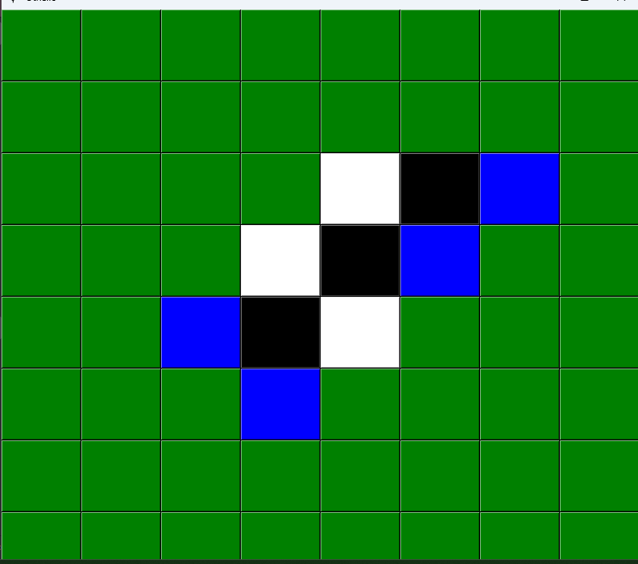
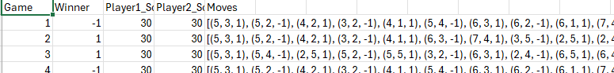
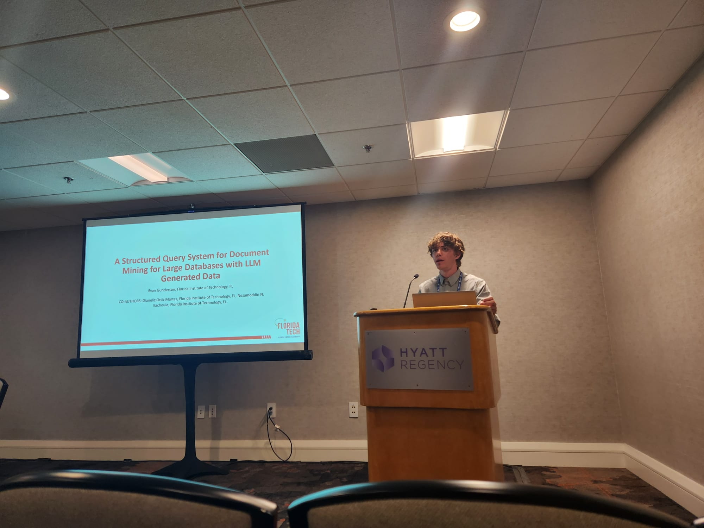
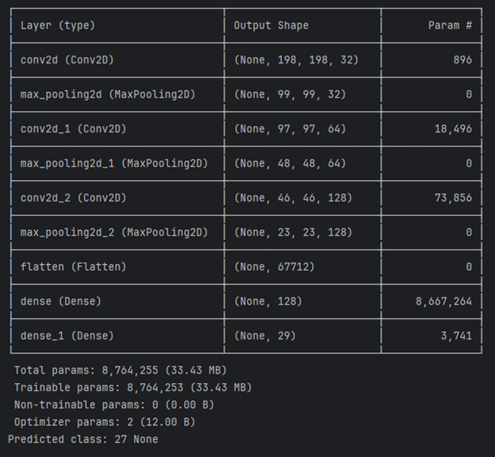

# Evan Gunderson
### [LinkedIn](https://www.linkedin.com/in/egunderson2004/)
### [Download Resume (.docx)](Fall2024ResumeEvanGunderson.docx)
### Recent Works
#### Othello Reinforcement Learning Model with Self-Play

#### Oral Presentation at ERN ([Emerging Researchers National](https://emerging-researchers.org/))
"A Structured Query System for Document Mining for Large Databases with LLM Generated Data"
Small part of a larger project I work(ed) on related to LLMs

#### CNN for ASL Character Classification
I produced and trained a model to recognize sign language characters from the following dataset: [link to dataset](https://www.kaggle.com/datasets/grassknoted/asl-alphabet)
with a ~95% accuracy (missclassified 1 in 20 characters)

#### Inverse Kinematics with Obstacle Avoidance
Implemented a robot arm with inverse kinematics using jacobian approximation that included seeking a target and avoiding obstacles as well as joint limits. Modeled in Blender and Vedo

#### Hosted a Lecture and Lab on Creating a CNN for MNIST dataset
[Link to Slides](https://docs.google.com/presentation/d/1WL52Snc8O_rBL7BM6JoHkGTVpNTea9CC7mN0u-srdzk/edit?usp=sharing)
#### Pipeline for High Energy Physics Simulation with Custom Lagrangians
Uses C++, C, Python and other languages
[HEP Lab website](https://research.fit.edu/hep/)

### Completed and IP Courses
CSE:

1001/2 fund of soft dev 1 & 2
1101 comp discip & careers
1400 applied discreet mth
2120 computer orginization & machine prog
2010 algorithms and data structures
2050 prog in a second lang
2410 intro to software engineering
3120 computer arch & assembly
3231 computer networks
4081 intro to analysis of algorithms
4001 operating systems concepts
4083 formal languages & automata theory
4224 intro to machine learning (also listed as MTH)
4250 prog lang concepts
5/4280 computer graphics algorithms
4301 intro to artificial intelligence

MTH:

1001/1002/2001 calculus 1 & 2 & 3
2401 probability & statistics
2201 differential equations & linear algebra
3102 intro to linear algebra
3210 intro to partial differential equations and apps
4234 statistical modeling

PHY:

1001/2002 physics 1 & 2
2091/2 phy lab 1 & 2
2003 modern physics
3440 electromag theory

COM:

1101 composition & rhetoric
1102 writing about literature
2223 scientific and technical communications

Others:

BIO 1AP biology elective
CSE 1AP CSE elective
PSY 1411 intro to psych
HUM 2051/2 Civ 1 & 2
HUM 2480 intro to pol sci
LNG 2101/2 intermediate french 1 & 2
HUM 3351 History of Science and Technology
